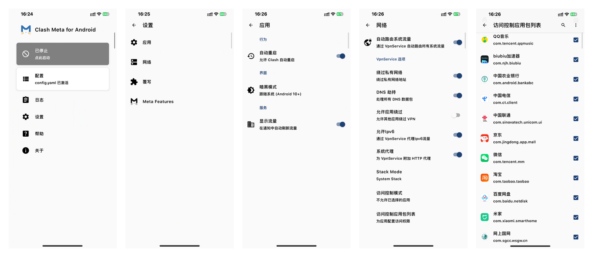
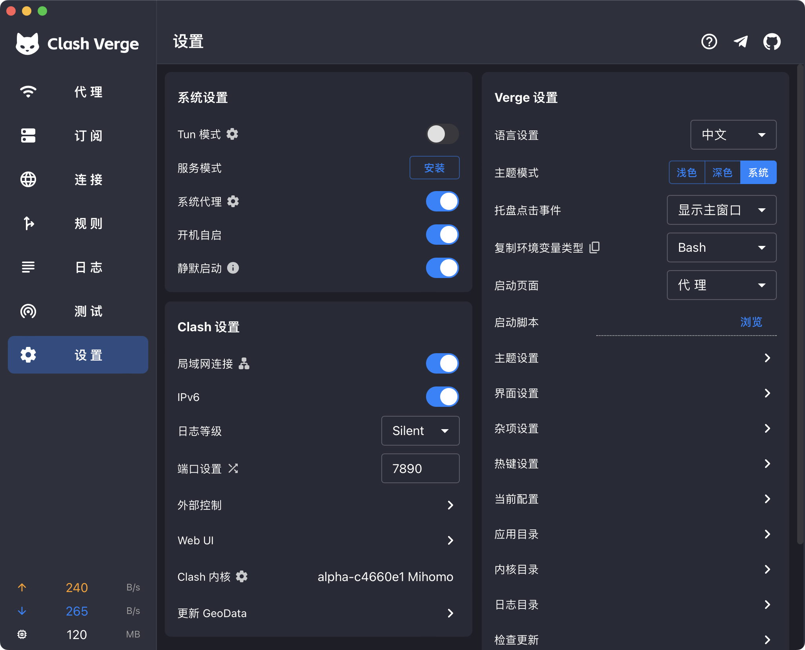

# Clash 从入门到精通

## 前言

Clash 分为两个部分，内核和客户端。
目前经许多大佬贡献，开源社区出现了许多的客户端，
现在已经可以实现一个 Clash 配置跨全部平台使用，
但是很多人并不太会使用 Clash 提供的功能，
依赖客户端和订阅转换、规则转换重复实现内核已有的功能。
故撰写本文实现：
- 多订阅聚合
- 最佳分流规则实践
- 一个配置跨所有平台使用

### 内核

原版 Clash 内核已不再维护，现仍在积极维护且广泛使用的内核为 [mihomo](https://github.com/MetaCubeX/mihomo/tree/Alpha) (曾用名 clash meta)。
本文将 旧原版 Clash、clash premium 、mihomo、clash meta 等名字统称为 Clash，实际都是指 [mihomo](https://github.com/MetaCubeX/mihomo/tree/Alpha)。
推荐在使用旧原版 clash、clash premium 内核的用户及时切换到新内核，Clash 兼容旧配置。

### 客户端

客户端功能都是依托于内核，差别不大。

## 第一章 下载安装使用

### 1. 下载客户端

- Windows: [clash-verge-rev](https://github.com/clash-verge-rev/clash-verge-rev/releases)
- macOS: [clash-verge-rev](https://github.com/clash-verge-rev/clash-verge-rev/releases)
- Android: [ClashMetaForAndroid](https://github.com/MetaCubeX/ClashMetaForAndroid/releases)
- iOS: 
  > 目前并没有完善好用的开源客户端，仅推荐上架外区 App Store 兼容 Clash 配置的客户端:
  - [Stash](https://stash.ws/) 
  > 美区 $3.99、**不完全兼容 Clash 内核配置**，仅兼容旧的 Premium 内核配置
  - [Shadowrocket](https://apps.apple.com/us/app/shadowrocket/id932747118)
  > 美区 $2.99，**仅能导入 Clash 配置的节点使用，不能通过配置文件配置**
- Linux: [clash-verge-rev](https://github.com/clash-verge-rev/clash-verge-rev/releases)
- 其他系统: 推荐直接使用 [mihomo](https://github.com/MetaCubeX/mihomo/tree/Alpha) 内核，面板等不在此处做推荐。

自行下载安装。
### 2. 使用

#### 移动端

使用的方法一般是：

1. 在配置里导入订阅链接
2. 主界面相应按钮点击后启动
3. 按提示允许建立 VPN 连接
4. 状态中心出现 VPN 样式图标说明正在使用中。

桌面端

使用的方法一般是：

1. 双击应用图标打开应用， 一般会在任务栏托盘区显示相应程序的图标
2. 点击托盘区图标显示主界面
3. 在订阅面板里导入订阅链接并选择新导入的订阅
4. 右键单击程序图标勾上**系统代理**
5. 重新打开你需要使用代理的浏览器即可使用

自行探索客户端界面。

**此时已经能满足大部分人日常使用的使用需求了。**

## 第二章 客户端设置

### 1. 移动端

#### Android 设置示例



其他保持默认，通过配置文件设置即可。

#### iOS 设置示例

- Stash: 参考其官方 [快速上手](https://stash.wiki/get-started) 文档
- Shadowrocket: 参考其官方 [使用教程](https://www.shadowrocket.vip/%E4%BD%BF%E7%94%A8%E6%95%99%E7%A8%8B)

### 2. 桌面端

#### Windows、Linux、macOS 设置示例



其他保持默认。

## 第三章 进阶：配置文件编写

参考文档 [wiki.metacubex.one](https://wiki.metacubex.one/config/)

### 1. 准备

首先，使用 vscode 打开一个空文件夹，里面新建空文件

- config.yaml (Clash 配置文件)
- manual.txt (填写单个服务器节点链接用)
- manual.yaml (**可选**，填写单个服务器节点详细信息用，查看 [sample/manual.yaml](sample/manual.yaml) 示例)

本文使用示例数据(均为假数据，演示用)：

订阅链接:

免费订阅1 :`https://freesub1.com/clash.yaml`

自购机场订阅2 :`https://airport2.com/sub/sample`

自建订阅3: `https://own3.com/sub.yaml`


单个节点:

自建节点1: `vless://6a3465e8-d263-4462-b0d2-147e3cd655bd@1.1.1.1:12345?type=ws&security=none&path=%2F856ca3a7#test|sample1@xyz.com`

共享节点2: `vless://6f47f83c-fe96-4727-9f83-2d32f7afc7ed@2.2.2.2:12345?type=ws&security=none&path=%2F856ca3a8#test|sample2@xyz.com`

### 2. 编辑 `config.yaml`

使用 vs code 编辑 `config.yaml` 这个空文件

首先写入基础配置

```yaml
mode: rule 
mixed-port: 7890 # http(s) 和 socks 代理混合端口
log-level: silent # 需要查看日志，在客户端设置即可
ipv6: true # ipv6 总开关，关闭将阻断所有 ipv6 链接和屏蔽 dns 请求 aaaa 记录
allow-lan: true # 允许局域网连接
bind-address: "*" # 绑定 ip 地址，仅作用于 allow-lan 为 true，'*'表示所有地址
geox-url: #自定义 geodata url
  geoip: "https://testingcf.jsdelivr.net/gh/MetaCubeX/meta-rules-dat@release/geoip.dat"
  geosite: "https://testingcf.jsdelivr.net/gh/MetaCubeX/meta-rules-dat@release/geosite.dat"
  mmdb: "https://testingcf.jsdelivr.net/gh/MetaCubeX/meta-rules-dat@release/country.mmdb"
  asn: "https://github.com/xishang0128/geoip/releases/download/latest/GeoLite2-ASN.mmdb"
geodata-mode: true # true 使用 .dat, false 使用 .mmdb
geo-auto-update: true
geo-update-interval: 720
external-controller: 0.0.0.0:9090 # api 监听地址
secret: change-me-to-a-complex-secret # 修改为你自己安全的密码
global-ua: baidu # 内核下载配置资源使用的 ua，默认值 clash.meta.
unified-delay: true # 消除连接握手等带来的不同类型节点的延迟差异
tcp-concurrent: true # TCP 并发
global-client-fingerprint: random # 全局客户端指纹，按概率生成一个现代浏览器指纹。
profile: # 内核缓存
  store-selected: true # 储存 API 对策略组的选择，以供下次启动时使用

tun: # PC 全局代理配置，按这样写就行，具体说明看参考文档
  enable: false
  stack: system
  strict-route: true
  endpoint-independent-nat: true
  dns-hijack:
    - any:53
    - tcp://any:53
    - any:853
    - tcp://any:853

dns: # dns 配置
  enable: true # 关闭将使用系统 dns
  listen: 0.0.0.0:1053
  prefer-h3: true
  ipv6: true # false 将返回 aaaa 的空结果
  ipv6-timeout: 50 # 单位：ms，内部双栈并发时，向上游查询 aaaa 时，等待 aaaa 的时间，默认 100ms
  use-system-hosts: true
  use-hosts: true

  default-nameserver: # 用来解析 DNS 服务器的域名，必须为 IP，可使用加密 DNS
    - https://223.5.5.5/dns-query

  # Clash 内核特有的设置，优先于所有 nameserver/fallback 查询，分流更方便精准
  nameserver-policy: # 指定域名查询的解析服务器，可使用 geosite, 
    "geosite:tld-cn,private,cn": # 指定中国大陆的网站使用的 DNS
      - https://223.5.5.5/dns-query
      - system # 电脑默认 DNS
      - dhcp://system # 仅供 ClashMetaForAndroid 使用

    "geosite:tld-!cn,gfw,geolocation-!cn": # 指定非中国大陆的网站使用的 DNS
    # 按你自己能访问的 DoH 服务器设置吧，我这里只列出了我能使用的示例
      - https://dns.twnic.tw/dns-query
      - https://10unu08q1g.cloudflare-gateway.com/dns-query

  # 为了兼容旧版内核保留的设置内容，功能和上面对应的相同，但分流功能没有 policy 丰富完善
  nameserver:
    - https://223.5.5.5/dns-query
    - system
    - dhcp://system
  fallback:
    - https://dns.twnic.tw/dns-query
    - https://0zc4480u40.cloudflare-gateway.com/dns-query
```

